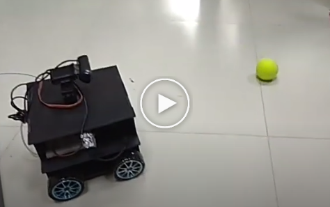

# Pet Robot - FabLabDU

This project was aiming to build a a four-wheeler companion bot which can follow a person or an object.

## Tools

- `Raspberry Pi` - The main module carrying out the image processing and robot control
- `Logitech C310` - Capturing images

## Image

## Video Demostration

  

